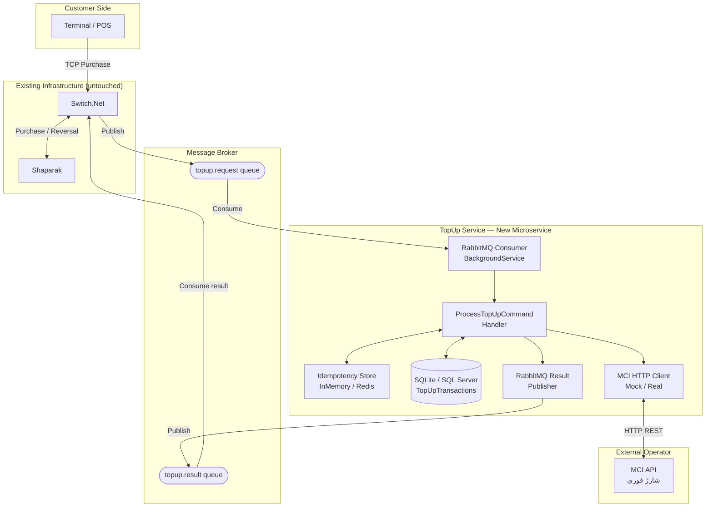
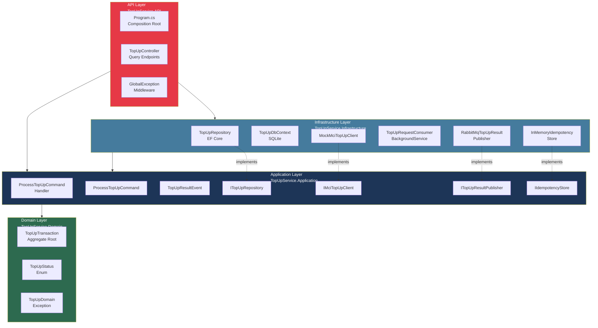
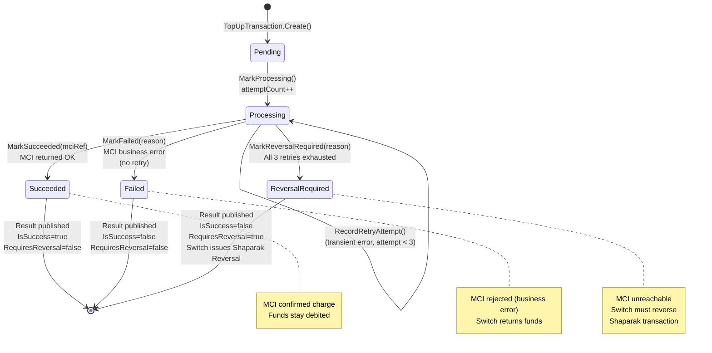
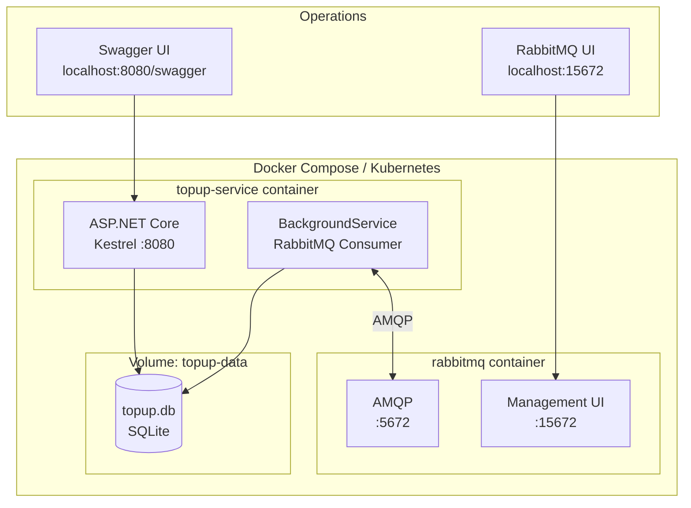

# Architecture Diagrams

## 1. System Architecture — Component View

---

## 2. Clean Architecture — Dependency Flow

---

## 3. State Machine — TopUpTransaction Lifecycle

---

## 4. Deployment Architecture

