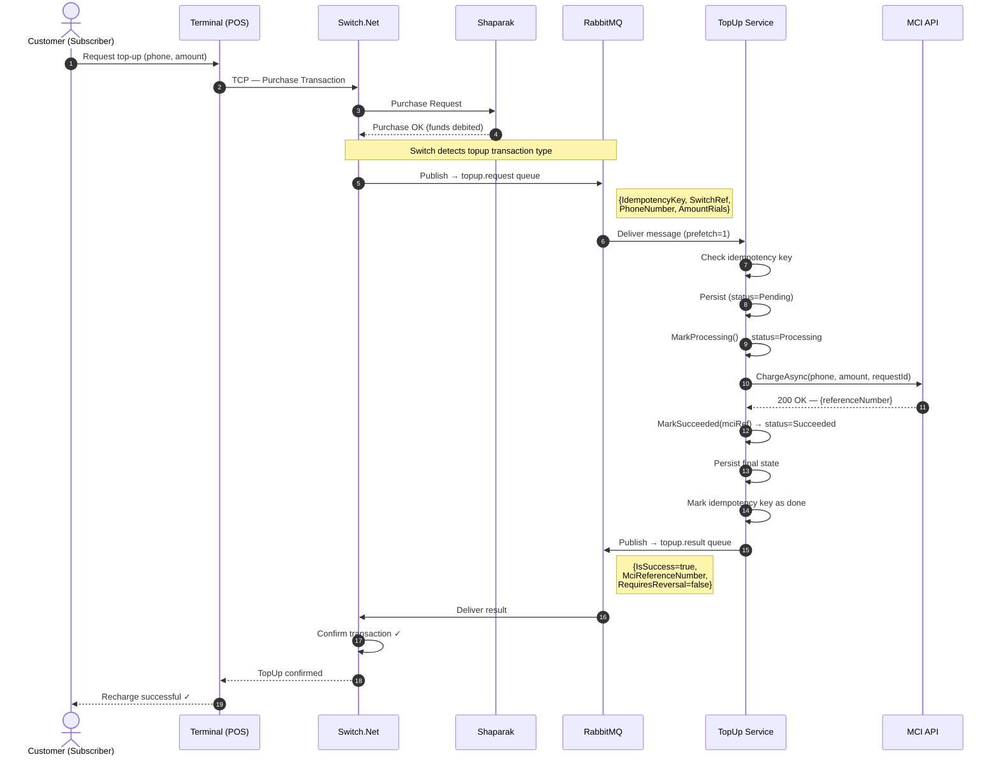
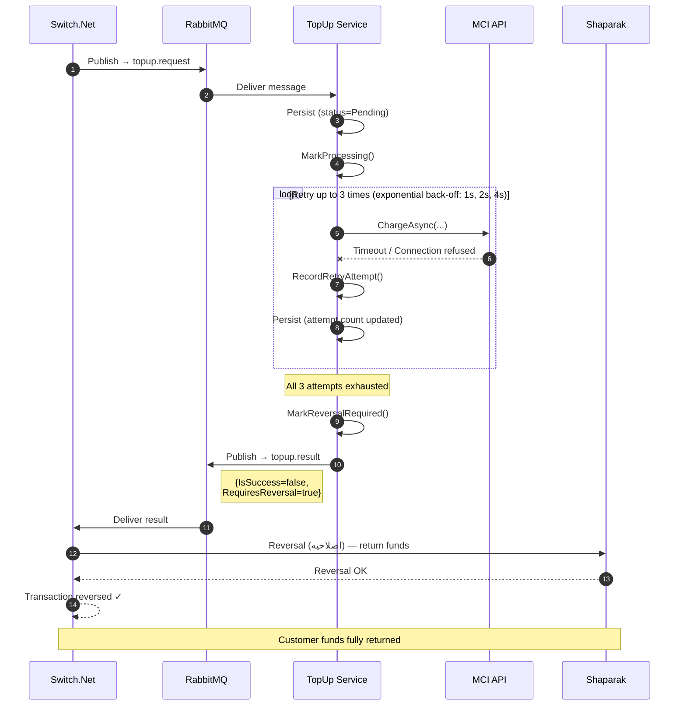
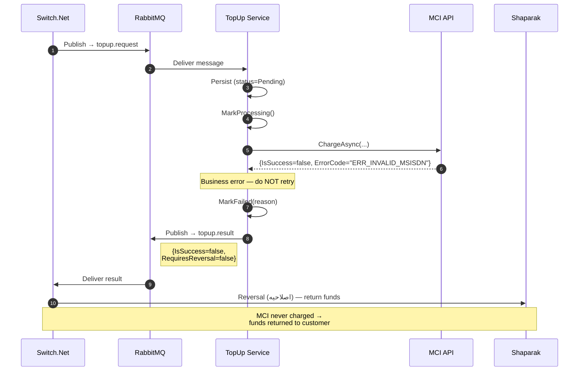
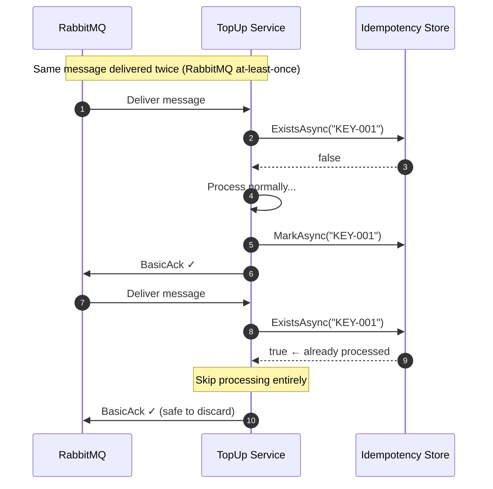

# Sequence Diagrams

## 1. Happy Path — Successful TopUp

---

## 2. Transient Failure Path — MCI Unreachable (Reversal Required)

---

## 3. Business Failure Path — MCI Rejects Request

---

## 4. Duplicate Message (Idempotency Guard)

